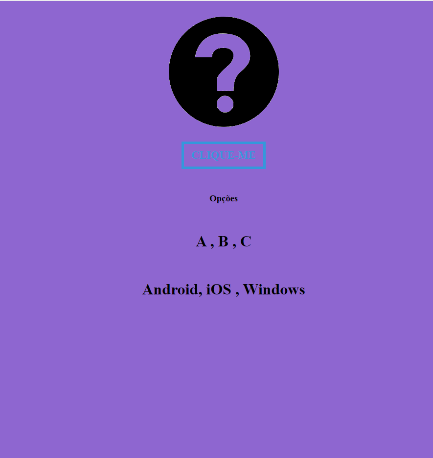

# REDIRECIONA DISPOSITIVO

> EXEMPLO PARA CLIENTE

Projeto construido para mostra um botão ou link onde após o usuario clicar, 
ele é redirecionado para uma pagina de acordo com o seu dispositivo.

[ Clique aqui para acessar](https://douglascorreacavasso.github.io/RedirecionaDispositivo/)

## Tecnologias

- HTML
- CSS
- Git e Github
- JavaScript

## Contato

douglas.cavasso@gmail.com